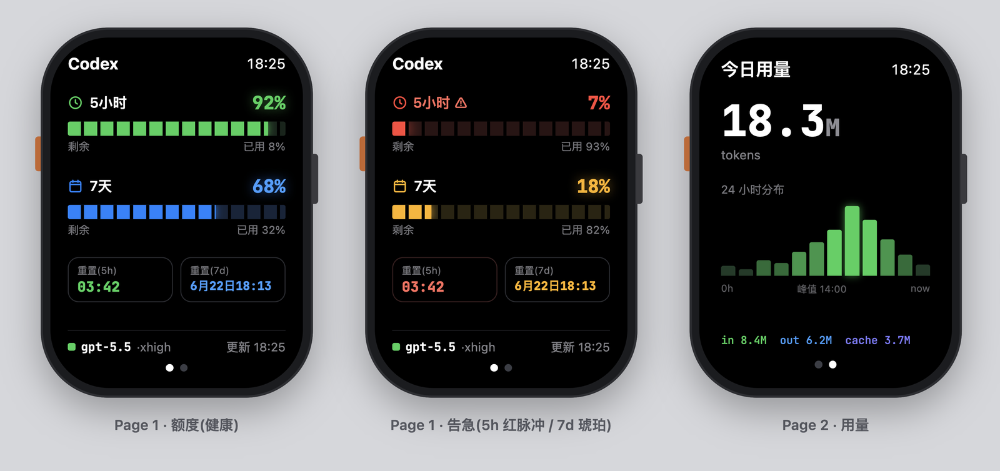
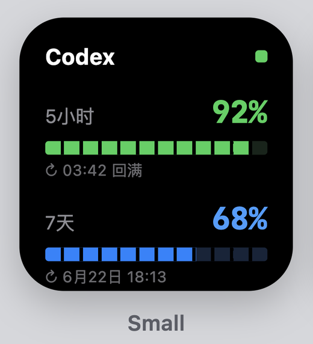
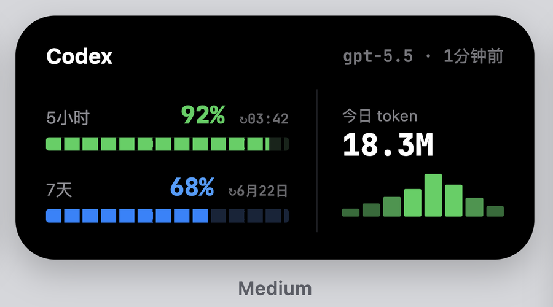
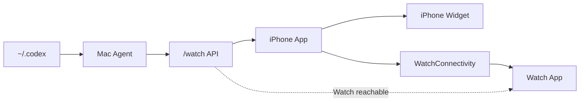

# Codex Quota

<p align="center">
  
</p>

<table>
  <tr>
    <td align="center" width="35%">
      
    </td>
    <td align="center" width="65%">
      
    </td>
  </tr>
</table>

把本机 Codex 使用摘要显示到 Apple Watch 和 iPhone Widget 上。本次发布版本只做一条清晰路径：Mac Agent -> iPhone 配置与同步 -> Watch App / Widget 显示额度概览。

本项目以 AGPL-3.0 开源，欢迎个人学习、使用和贡献。



## 适合谁

适合已经在 Mac 上使用 Codex，并愿意用 Xcode 把一个开源示例 App 安装到自己 iPhone 和 Apple Watch 的用户。

这不是 App Store 产品，也不是免 Xcode 安装包。Apple ID 登录、Team 选择、设备信任、Developer Mode 和签名确认仍然需要你自己点。

## 让 Codex 带你安装

推荐新手直接把下面这句话发给本机 Codex：

```text
请在 /Users/<你的用户名>/codex-quota-watch 按 README 和 docs/setup.md 带我安装 Codex Quota 到我的 iPhone 和 Apple Watch。不要 push，不要公开仓库，不要打印 WATCH_TOKEN、agent/.env、Apple Team ID、签名证书或 provisioning profile。遇到 Xcode 登录、Team、设备信任、Developer Mode、watchOS platform 缺失时停下来告诉我具体点哪里。
```

也可以复制完整部署提示词：

- [Codex 本机部署 prompt](docs/codex-deploy-prompt.md)

## 手动三步开始

1. 安装并启动 Mac Agent：

```bash
scripts/install-launch-agent.sh --lan
```

2. 配置 iOS 标识并打开 Xcode：

```bash
scripts/configure-ios-identifiers.sh --bundle-id com.yourname.CodexQuota
open ios-watch/CodingQuota.xcodeproj
```

在 Xcode 里给四个 target 选择同一个 Apple Team：

```text
CodingQuota
CodingQuota Watch App
CodingQuotaWidgetExtension
CodingQuotaWatchWidgetExtension
```

然后选择你的实体 iPhone 运行 `CodingQuota` scheme。Watch App 会作为 companion Watch App 安装到已配对的 Apple Watch，iPhone Widget 会随 iPhone App 安装。

3. 打开配对二维码：

```bash
scripts/show-pairing-qr.sh --open-html
```

iPhone App 点 `Scan Pairing QR`，扫浏览器页面里的二维码，扫码后点 `Fetch & Sync to Watch`，再打开 Watch App `Codex Quota`。二维码包含 `WATCH_TOKEN`，不要截图公开。

安装并同步一次后，在 Apple Watch 上长按当前表盘，点“编辑”并进入“复杂功能”，选择 `Codex Quota`。矩形槽位信息最完整，可同时显示 5h / 7d 剩余额度。

## 现在能看什么

- Codex 5h / 7d bucket、剩余额度、已用比例、重置时间。
- Codex 今日 input / output / cache token 摘要。
- Apple Watch 打开时主动刷新；失败时显示最近一次 iPhone 同步快照。
- Apple Watch 表盘 Complication 常驻显示 5h / 7d 剩余额度，支持矩形、圆形、角落和单行样式。
- iPhone small / medium Widget 显示最近一次 iPhone 成功同步的快照。

## 本次发布范围

- 本次发布版本只包含 Mac Agent、iPhone 配置与同步、Apple Watch App、iPhone small / medium Widget。
- 不暴露 `active_session`、`project_activity`、`latest_message`、项目路径或最近消息。
- 不提交 `agent/.env`、真实 token、`~/.codex`、cookies、Apple Team ID、签名证书或 provisioning profile。

## 重要边界

- `WATCH_TOKEN` 必需；二维码或 token 泄露后运行 `scripts/rotate-watch-token.sh --restart-launch-agent`。
- Mac Agent 只建议用于 localhost、可信局域网或私有 Tailscale，不要暴露公网。
- Personal Team 真机安装通常 7 天后会过期，需要用 Xcode 重新安装。
- Watch 直连只在 Watch 能访问 Mac Agent URL 时生效；否则显示最近快照并请求 iPhone 同步。
- iPhone Widget 只读 App Group 里的最近快照；iOS 可能延迟 Widget timeline 刷新，不能当成实时刷新引擎。

## 文档

- [完整安装](docs/setup.md)
- [Xcode 真机安装演示](docs/xcode-device-install.md)
- [Codex 本机部署 prompt](docs/codex-deploy-prompt.md)
- [真机检查清单](docs/device-checklist.md)
- [架构和刷新频率](docs/ARCHITECTURE.md)
- [常见问题](docs/troubleshooting.md)
- [安全说明](SECURITY.md)

## 开发检查

```bash
cd agent && python3 -m pytest
swift test --package-path ios-watch
scripts/check-public-ready.sh --worktree
```

## 上游项目

本仓库基于 [cyq1017/codex-quota-watch](https://github.com/cyq1017/codex-quota-watch) 开发，并保留原项目提交历史与 AGPL-3.0 许可。

## License


AGPL-3.0 © 2026 从野秦。

商用或闭源集成需单独获得作者授权。
