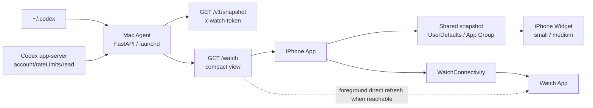

# Architecture

## 数据流

Mac Agent 只输出摘要和 quota 状态，不返回原始 `~/.codex`、auth 文件、cookies 或 Apple 签名材料。

`/v1/snapshot` 是面向客户端的完整快照，按 `providers.codex` 分组，包含 quota、today 和 hourly。`/watch` 是同一快照的轻量版，额外压缩为 iPhone / Watch 容易解码的 provider 字段，并包含 24h hourly heatmap 数据。

客户端契约见 `schemas/snapshot.schema.json`，示例见 `docs/examples/snapshot-response.json` 和 `docs/examples/watch-response.json`。

quota adapter 或本地扫描失败时，Mac Agent 仍返回 snapshot；provider `status` 会标为 `error`。返回给客户端的 `error` 只保留脱敏摘要，不返回原始本机路径、token、cookie 或完整 URL 查询串。

## 范围边界

本次发布版本只做 Apple Watch App 和 iPhone small / medium Widget。iPhone App 是配置、拉取和同步入口，Widget 只读最近快照。

## 刷新频率

| 位置 | 默认行为 | 说明 |
|---|---|---|
| Mac Agent | launchd 常驻，`CACHE_TTL_SECONDS=60` | `/v1/snapshot` 或 `/watch` 被请求时构建 snapshot；60 秒内复用缓存 |
| iPhone foreground | 300 秒 | iPhone App 打开且 auto refresh 开启时循环拉取 |
| iPhone background | 15 分钟 earliest begin | iOS 可能延迟或跳过后台任务；不是常驻 daemon |
| iPhone Widget | 15 分钟 timeline request + fetch 成功后请求 reload | WidgetKit 可能合并或延迟；Widget 不直接请求 Mac Agent |
| Watch App | 打开时先直连 Mac Agent，失败后请求 iPhone 刷新 | 直连需要 Watch 能访问 Mac Agent URL；否则使用 WatchConnectivity 和最后一次快照兜底 |
Mac Agent 是唯一能按桌面服务方式常驻的部分。iPhone、WidgetKit 和 watchOS 的后台执行受系统电量、网络、使用习惯和刷新预算控制，只能做“尽量更新 + 打开时主动刷新 + 可排队请求 + 显示最后快照”，不能承诺持续驻留。

## 鉴权和网络边界

- `WATCH_TOKEN` 必须配置为至少 24 位 URL-safe 随机字符，缺失、太短、非法字符或占位值会拒绝启动。
- `/usage`、`/v1/snapshot` 和 `/watch` 都要求 `x-watch-token`。
- iPhone 保存 `WATCH_TOKEN` 使用 Keychain；Mac URL 和最近快照使用 App Group `UserDefaults`。
- 公开版本不同步最近会话标题、项目路径或消息摘要；客户端只接收 quota、bucket、today 和 hourly token 摘要。
- 默认不启用 CORS；原生 iPhone / Watch 客户端不需要浏览器 CORS。
- 默认只适合本机或可信局域网。不要把 Agent 暴露到公网。
- 出门访问时优先使用 Tailscale Serve 到 `127.0.0.1:8787`，让 Agent 继续只监听 localhost。
- 不要使用 Tailscale Funnel 作为默认部署方式；Funnel 会创建公网入口。

## Codex 额度

Codex 额度默认走 Codex App Server 的 `account/rateLimits/read`。
